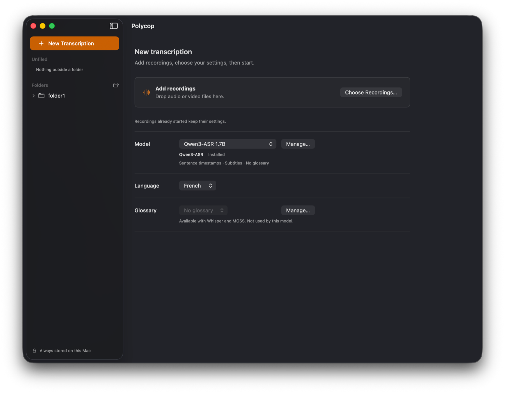

# Polycop

[](https://github.com/miravassor/polycop/actions/workflows/ci.yml)


Polycop turns speech into text on Apple Silicon Macs. It was first built to
transcribe university lectures with open source tools only, running entirely on
the student's own Mac: the recording never leaves it, so a course, which
belongs to the teacher who gives it, stays in the hands of the people who
attend it.

Because the code is open source and the app is free, teachers and students can
both check what it does. That is what makes it a tool both sides can trust.

Lectures are what it was made for, but it transcribes any audio or video file.

A transcript is only a first draft, so Polycop is growing into a transcription
and editing suite: everything needed to listen to the text, correct it and export
it clean, in the same window as the recording. New work goes into both halves.



A lecture belongs to the people who give it. Record and transcribe one only
with the teacher's permission, and keep the transcript for your own study
unless they agree to more.

## Features

### Transcription

* **On your Mac.** No account, no upload, no tracking. The network is only used
  to download models and to check for a new version, when you ask or once a day
  if you allow it.
* **Several models**, each downloaded from inside the app and checked before
  use (see below).
* **Course glossaries** for the models that use them: type the terms, import a
  list, or let the app suggest them from your course documents (PDF, Word, RTF,
  plain text).
* **Import** of a transcript made elsewhere (TXT or Word document with
  timestamps, SRT, VTT, Whisper or audio.cpp JSON) with its recording, to correct
  it the same way.
* **Library** of transcripts, sorted in folders. Your recordings stay where they
  are.
* **Safeguards**: a passage where a model repeats itself is shortened, stretches
  that need a second listen are marked, and the Mac stays awake during a long
  job.

### Editing

* **Correction while listening.** Click a timestamp, or Option-click a word, to
  hear the passage; the word being heard is highlighted. Playback pauses when you
  start typing, resumes on its own once you stop, and steps back a little so the
  sentence is heard again. Fix the text in place, step back one correction at a
  time, or return to the original.
* **Words the model was unsure of** are underlined, for Whisper transcripts.
* **Find and replace**, with Replace All as one correction to undo. A
  replacement can be remembered for a course and applied to its next
  transcripts.
* **Changes shown as a diff** between what the model wrote and your corrected
  text.
* **Audio player** made for proofreading: playback speed, a timeline with the
  paragraphs, the next or previous paragraph from the keyboard, and the text
  following playback until you scroll away. Space plays and pauses when you are
  not typing, and Esc leaves the text. The keyboard media keys, Control Center
  and headphone buttons control it too.
* **Review marks** on passages to check later.
* **Export** to text with or without timestamps, to Markdown or to a Word
  document, with hesitations such as "euh" left out if you want, and to SRT
  subtitles when the model times its sentences.

## Models

| Model | Download | Memory at peak | Notes |
|---|---:|---:|---|
| Whisper Large v3 turbo (recommended) | 1.6 GB | 2.8 GB | fast; reads a glossary |
| Whisper Large v3 turbo quantized | 0.9 GB | 2.0 GB | fast; half the download |
| Whisper Large v3 | 3.1 GB | 5.0 GB | the full Whisper model, slower |
| Qwen3-ASR 1.7B | 2.5 GB | 3.9 GB | sentence timings with the optional aligner |
| MOSS-Transcribe-Diarize 0.9B | 1.1 GB | 5.6 GB | labels speaker turns |
| Voxtral Mini 4B Realtime | 5.1 GB | 6.0 GB | streamed; takes about as long as the recording |

The optional Qwen3 Forced Aligner (1.1 GB) times each sentence of a Qwen3-ASR
transcript, which makes subtitles possible. Qwen3-ASR and Whisper are told the
language (French or English); MOSS and Voxtral detect it. Every model has its own
licence, shown before you download it.

Each engine's settings and every processing step, such as where long audio is
cut, what a glossary is turned into and how repetitions are reduced, were chosen
after benchmarks on real lecture recordings against transcripts corrected by
hand. No model is best everywhere: results vary with the course, the room and the
speaker, so trying two models on your own recordings is worth it.

## Requirements

* A Mac with Apple Silicon (M1 or later) and macOS 14 Sonoma or later.
* Enough free disk space for the models you choose, and enough memory for the
  one you run: the app refuses a model too large for your Mac, and says why.
* Nothing else to install. The app downloads the models itself, over a secure
  connection, and checks each file against its published SHA-256 fingerprint.

## Install

1. Download `Polycop-X.Y.Z.dmg` and its `.sha256` file from the
   [latest release](https://github.com/miravassor/polycop/releases/latest).
2. Check the disk image: `shasum -a 256 -c Polycop-X.Y.Z.dmg.sha256`. A match
   shows the file arrived intact, but the checksum comes from the same page, so
   it cannot show who built it. For that, with the
   [GitHub command line tool](https://cli.github.com), run
   `gh attestation verify Polycop-X.Y.Z.dmg --repo miravassor/polycop`: it
   checks the file was built by this repository's release workflow and names
   the commit. Releases after 0.3.2 are attested.
3. Open it and drag Polycop to Applications. Replacing an older version keeps
   your library in `~/Library/Application Support/Polycop/`.
4. Open the app. Polycop is not yet signed with an Apple Developer ID, so macOS
   refuses to open it the first time. See below.

The release also offers `Polycop-X.Y.Z.zip`: the same app, with the source of
every component it ships and the instructions to build it.

Polycop does not update itself. On its second launch it asks whether to check for
a new version once a day; you can change that in Settings, or choose **Check for
Updates…** in the Polycop menu at any time. When a newer version is out, it opens
its release page.

### If macOS refuses to open it

1. Open System Settings, then Privacy & Security, scroll down and click
   **Open Anyway** next to the message about Polycop
   ([Apple's instructions](https://support.apple.com/102445)).
2. If there is no Open Anyway button, which happens with apps that have no
   developer signature, run this once in Terminal:

   ```sh
   xattr -dr com.apple.quarantine /Applications/Polycop.app
   ```

   It removes the mark macOS puts on downloaded files, for this app only, and
   changes no other setting. Do it only for a copy you checked in step 2,
   ideally with the attestation.

## Using it

1. Download a model from inside the app. Start with Whisper Large v3 turbo.
2. Choose a course glossary if you have one, then add your recordings. They are
   transcribed one after another, with no conversion on your side.
3. Listen back and correct the text: Option-click a word to hear it, and use Find
   and Replace for a name the model keeps mishearing. Corrections are saved in
   the library.
4. Export the text in the layout you want, with subtitles if you want them.
   Subtitles keep the model's words and timings; your corrections go into the
   text file.

## Good to know

* Every model makes mistakes, and now and then one writes a sentence nobody
  said. Listening back is still part of the work.
* A glossary nudges the vocabulary, it promises nothing. Whisper reads at most
  its last 223 tokens, and the app warns when yours is longer. MOSS reads it as
  hotwords. Qwen3-ASR and Voxtral do not use it.
* Recordings can be up to four hours long.
* Pausing keeps the text obtained so far; a few words may be dropped or repeated
  where the work resumes, and those spots are marked. A paused job does not
  survive quitting the app.

## Uninstall

1. Quit Polycop and move `Polycop.app` to the Bin.
2. To remove your transcripts, glossaries and downloaded models as well, delete
   the folder `~/Library/Application Support/Polycop/` (in the Finder, choose
   Go > Go to Folder). Models take up to 5 GB each.

Your recordings and exported files are never stored there, and stay where they
are.

## Build from source

See [CONTRIBUTING.md](CONTRIBUTING.md). You need Xcode 27, CMake and GnuPG; the
scripts in `Tools/` build every dependency from pinned, verified sources.

## Licence

Polycop is free software under the GNU General Public License version 3 or later
(see [LICENSE](LICENSE)). The components it ships and their licences are listed
in [THIRD_PARTY_NOTICES.md](THIRD_PARTY_NOTICES.md). Model weights carry their own
licence, and their training data is not fully published.
